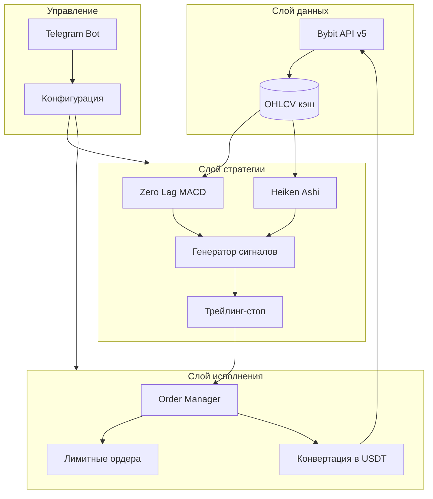

# План разработки торгового бота ZL MACD+HA+Trailing

## Архитектура проекта




---

## ✓ Этап 0: Выбор архитектуры (критическое решение)

### Вариант A: Webhook (TradingView → сервер → Bybit)

- **Плюсы:** Переиспользование backtest TradingView, проще валидация сигналов
- **Минусы:** Нужна платная подписка TradingView (alerts), привязка к TV
- **Реализация:** Flask/FastAPI endpoint принимает webhook, парсит сигнал, исполняет на Bybit

### Вариант B: Standalone (полный Python-бот)

- **Плюсы:** Независимость от TradingView, один источник логики, бесплатно
- **Минусы:** Нужно точно воспроизвести ZL MACD Enhanced; тестирование сложнее
- **Реализация:** Бот сам получает свечи, считает индикаторы, генерирует сигналы

**Рекомендация:** Вариант B (standalone) — полный контроль, отсутствие зависимости от TradingView, все «красные» параметры реализуемы в одном месте.

---

## ✓ Этап 1: Инфраструктура и окружение (1–2 дня)

**Задачи:**

1. Создать структуру проекта (см. ниже)
2. `requirements.txt`: `pybit`, `python-telegram-bot` (или `aiogram`), `pandas`, `numpy`, `python-dotenv`, `aiohttp`
3. `.env.example` с шаблоном переменных: `BYBIT_API_KEY`, `BYBIT_API_SECRET`, `TELEGRAM_BOT_TOKEN`
4. Конфиг (YAML/JSON): все параметры стратегии и исполнения

**Структура проекта:**

```
torgovyibot/
├── src/
│   ├── exchange/       # Bybit API wrapper
│   ├── strategy/       # ZL MACD, Heiken Ashi, сигналы
│   ├── execution/      # Ордера, конвертация в USDT
│   ├── telegram/       # Telegram bot handlers
│   └── main.py         # Точка входа
├── config/
│   └── config.yaml
├── tests/
├── .env.example
├── requirements.txt
└── README.md
```

---

## ✓ Этап 2: Слой данных (2–3 дня)

**Задачи:**

1. **Bybit API v5** (Unified Account / Contract):
  - Получение OHLCV (kline) для нужных пар и таймфреймов
  - Использовать `get_kline` (или `get_kline` для perpetual)
2. Кэширование свечей во избежание лишних запросов
3. Поддержка таймфреймов: 5m, 15m, 30m, 1h, 4h, 12h, 1D, 1W
4. Маппинг таймфреймов Bybit (`1`, `5`, `15`, `60`, `240`, `D`, `W`)

---

## ✓ Этап 3: Реализация стратегии (3–4 дня)

### Референс: Zero Lag MACD Enhanced 1.2 (оригінальний код)

**Джерело:** TradingView — індикатор veryfid, доопрацьований Albert Callisto (AC). Версія 1.2, оновлення 19.12.2017. Повний оригінальний код надано користувачем у чаті.

**Ключові формули для торгової логіки:**

```
// ENHANCED ZERO LAG MACD

// Version 1.2

//

// Based on ZeroLag EMA - see Technical Analysis of Stocks and Commodities, April 2000

// Original version by user Glaz. Thanks ! https://www.tradingview.com/chart/EURUSD/UV0YI6Wy-ZeroLag-Macd

// Ideas and code from @yassotreyo version.

// Tweaked by Albert Callisto (AC)

//

// Last Update 19.12.2017

// (AC - 1.0) Histogram with two colors, choice between SMA/EMA (SMA = "Glaz mode"), names for sub-components, renaming of variables

// (AC - 1.1) Added choice between "Glaz" and legacy algorithm + introduced EMA on MACD (thanks @yassotreyo for your original version)

// (AC - 1.2) Added option to show dots above (requested by another user)


study(title="Zero Lag MACD Enhanced - Version 1.2", shorttitle="Zero Lag MACD Enhanced 1.2")

source = close


fastLength = input(12, title="Fast MM period", minval=1)

slowLength = input(26,title="Slow MM period", minval=1)

signalLength =input(9,title="Signal MM period", minval=1)

MacdEmaLength =input(9, title="MACD EMA period", minval=1)

useEma = input(true, title="Use EMA (otherwise SMA)")

useOldAlgo = input(false, title="Use Glaz algo (otherwise 'real' original zero lag)")

showDots = input(true, title="Show symbols to indicate crossing")

dotsDistance = input(1.5, title="Symbols distance factor", minval=0.1)


// Fast line

ma1= useEma ? ema(source, fastLength) : sma(source, fastLength)

ma2 = useEma ? ema(ma1,fastLength) : sma(ma1,fastLength)

zerolagEMA = ((2 * ma1) - ma2)


// Slow line

mas1= useEma ? ema(source , slowLength) : sma(source , slowLength)

mas2 = useEma ? ema(mas1 , slowLength): sma(mas1 , slowLength)

zerolagslowMA = ((2 * mas1) - mas2)


// MACD line

ZeroLagMACD = zerolagEMA - zerolagslowMA


// Signal line

emasig1 = ema(ZeroLagMACD, signalLength)

emasig2 = ema(emasig1, signalLength)

signal = useOldAlgo ? sma(ZeroLagMACD, signalLength) : (2 * emasig1) - emasig2


hist = ZeroLagMACD - signal


upHist = (hist > 0) ? hist : 0

downHist = (hist <= 0) ? hist : 0


p1 = plot(upHist, color=green, transp=40, style=columns, title='Positive delta')

p2 = plot(downHist, color=purple, transp=40, style=columns, title='Negative delta')


zeroLine = plot(ZeroLagMACD, color=black, transp=0, linewidth=2, title='MACD line')

signalLine = plot(signal, color=gray, transp=0, linewidth=2, title='Signal')


ribbonDiff = hist > 0 ? green : purple

fill(zeroLine, signalLine, color=ribbonDiff)


circleYPosition = signal*dotsDistance

plot(ema(ZeroLagMACD,MacdEmaLength) , color=red, transp=0, linewidth=2, title='EMA on MACD line')


ribbonDiff2 = hist > 0 ? green : purple

plot(showDots and cross(ZeroLagMACD, signal) ? circleYPosition : na,style=circles, linewidth=4, color=ribbonDiff2, title='Dots')

**Важливо:** Параметр `MacdEmaLength` в оригіналі використовується лише для червоної лінії «EMA on MACD line» — це візуальний елемент. У логіці входів/виходів він не бере участі. Сигнальна лінія завжди використовує `signalLength`.

**Ідея стратегії:** Якомога раніше ловити розворот тренду. Колір Heiken Ashi показує тренд; ZLMACD дає підтвердження з мінімальним запізненням. Закрити позицію в завершуючому тренді, якомога раніше увійти в новий тренд.

---

**Задачи:**

1. **Heiken Ashi:** Точная формула как в TradingView
  - `HA_close = (O+H+L+C)/4`
  - `HA_open = (prev_HA_open + prev_HA_close)/2`
  - `HA_high = max(H, HA_open, HA_close)`
  - `HA_low = min(L, HA_open, HA_close)`
  - Зеленая свеча: `HA_close > HA_open`, красная: `HA_close < HA_open`
2. **Zero Lag MACD Enhanced** — реалізувати за оригінальним кодом (див. референс вище):
  - Fast/Slow MM (EMA або SMA), Signal MM
  - Zero-lag: `2*ma1 - ma2`
  - Параметри: `use_ema`, `use_glaz_algo` (useOldAlgo)
  - `MacdEmaLength` не використовувати в торговій логіці
3. **Генератор сигналов:**
  - Long entry: `MACD > Signal` И зеленая HA-свеча
  - Short entry: `MACD < Signal` И красная HA-свеча
  - Long close: `MACD < Signal` И красная HA-свеча
  - Short close: `MACD > Signal` И зеленая HA-свеча
  - Вход на следующей свече после выполнения условий (и опционально на той же, если нужно — «примітка не для ШІ»)
4. **Трейлинг-стоп:**
  - Активация: при достижении X% прибыли от точки входа
  - Trailing: отступ Y% от цены входа (fixed offset)
  - Закрытие long: цена падает ниже trail-stop
  - Закрытие short: цена поднимается выше trail-stop

**Переменные параметры (из скриншотов и ТЗ):**


| Параметр              | Диапазон | По умолчанию | Примітка                            |
| --------------------- | -------- | ------------ | ----------------------------------- |
| Fast MM period        | 1+       | 12           |                                     |
| Slow MM period        | 1+       | 26           |                                     |
| Signal MM period      | 1+       | 9            | Для signal line                     |
| MACD EMA period       | 1+       | 9            | Опціонально (лише для відображення) |
| Trailing Activation % | 0+       | 0.1          |                                     |
| Trailing Stop %       | 0+       | 0.7          |                                     |
| Use EMA               | bool     | true         |                                     |
| Use Glaz algo         | bool     | false        | useOldAlgo в оригіналі              |


---

## ✓ Этап 4: Слой исполнения (3–4 дня)

**Задачи:**

1. **Расчет размера позиции:**
  - % реинвестирования (1–100%) от баланса/эквити
  - Учет плеча (1x–100x) для perpetual
2. **Лимитные ордера:**
  - Вход: лимитный ордер вместо рыночного (по текущей/прогнозной цене с небольшим отклонением)
  - Выход по сигналу: лимитный close
  - Выход по трейлинг-стопу: лимитный stop/trigger
3. **Конвертация в USDT после закрытия:** после каждой закрытой сделки — sell базового актива в USDT (для пар типа ETHUSDT — уже USDT, для USDC и др. — конвертация)
4. **Управление плечом:** установка leverage через API Bybit перед открытием позиции
5. **Защита от ликвидации:** мониторинг margin ratio, оповещение при приближении к ликвидации

---

## ✓ Этап 5: Telegram-бот (3–4 дня)

**Задачи:**

1. Команды:
  - `/start` — приветствие, краткая справка
  - `/status` — общий статус и PnL
  - `/pairs` — список пар и их статус (активно/остановлено)
  - `/start_pair ETHUSDT` — запуск торговли по паре
  - `/stop_pair ETHUSDT` — остановка по паре
  - `/start_all` / `/stop_all` — все пары
  - `/config` — просмотр и изменение параметров (inline или пошагово)
2. Уведомления:
  - Открытие/закрытие сделки (пара, направление, цена, PnL)
  - Ликвидация позиции
  - Остановка торговли (например, по команде или при критической ошибке)
3. Настройка параметров:
  - Через `/config` или отдельные команды
  - Сохранение в конфиг (YAML/JSON) и применение «на лету» (где возможно)

---

## ✓ Этап 6: Интеграция и многопоточность (2–3 дня)

**Задачи:**

1. Запуск отдельных «воркеров» по каждой торговой паре (или пул асинхронных задач)
2. Единый event loop, неблокирующие вызовы Bybit и Telegram
3. Graceful shutdown при остановке бота

---

## Этап 7: Тестирование и деплой (2–3 дня)

**Задачи:**

1. Unit-тесты для ZL MACD и Heiken Ashi (сравнение с эталонными значениями)
2. Paper-trading на testnet Bybit
3. Документация по установке и настройке
4. Инструкция по деплою (VPS, systemd/supervisor, или Docker)

---

## «Красные» параметры (из приміток)


| Параметр                        | Реализуемость | Где реализовать                       |
| ------------------------------- | ------------- | ------------------------------------- |
| % реинвестирования (1–100%)     | Да            | Расчет размера позиции при открытии   |
| Плечо (x1–x100)                 | Да            | Bybit API: set leverage               |
| Конвертация в USDT после сделки | Да            | После close: market/limit sell → USDT |
| Лимитные ордера вместо рыночных | Да            | Все entry/exit через limit order      |


---

## Оценка сроков


| Этап                      | Срок    | Статус |
| ------------------------- | ------- | ------ |
| 0. Решение по архитектуре | —       | ✓      |
| 1. Инфраструктура         | 1–2 дня | ✓      |
| 2. Слой данных            | 2–3 дня | ✓      |
| 3. Стратегия              | 3–4 дня | ✓      |
| 4. Исполнение             | 3–4 дня | ✓      |
| 5. Telegram               | 3–4 дня | ✓      |
| 6. Интеграция             | 2–3 дня | ✓      |
| 7. Тестирование и деплой  | 2–3 дня |        |


**Итого:** ориентировочно 16–23 рабочих дня.

---

## Риски и зависимости

- **Точність ZL MACD:** Оригінальний код індикатора (veryfid, Albert Callisto) надано — реалізація ведеться за еталоном.
- **Rate limits Bybit:** При багатьох парах і коротких таймфреймах потрібен обережний throttling.
- **Ликвидація:** При високому плечі — обовʼязкове тестування на testnet і попередження в Telegram.

